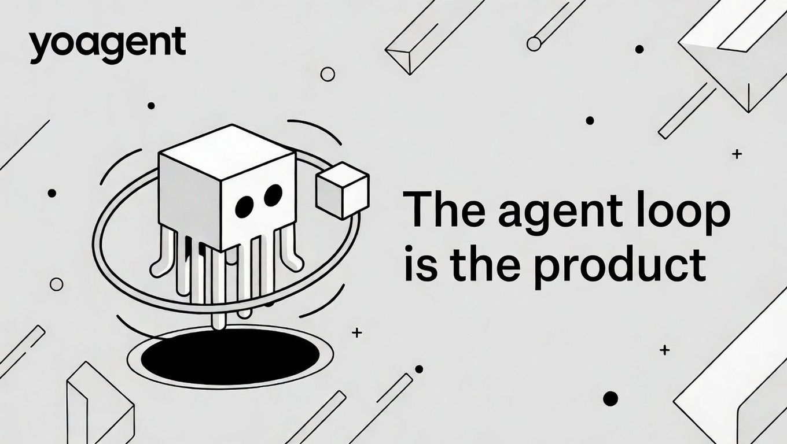

<div align="center">

<picture>
  
</picture>

<a href="https://yologdev.github.io/yoagent/">Docs</a> · <a href="https://github.com/yologdev/yoagent">GitHub</a> · <a href="https://deepwiki.com/yologdev/yoagent">DeepWiki</a> · <a href="https://github.com/yologdev/yoagent/issues">Issues</a> · <a href="https://github.com/yologdev/yoagent/releases">Releases</a>

[![][ci-shield]][ci-link]
[![][license-shield]][license-link]
[![][docs-shield]][docs-link]
[![][last-commit-shield]][last-commit-link]

</div>

---

## Overview

yoagent is a simple, effective agent loop with tool execution and event streaming in Rust. Inspired by [pi-agent-core](https://github.com/badlogic/pi-mono/tree/main/packages/agent).

The loop is the product. No over-engineered planning/reflection/RAG layers — just:

```
Prompt → LLM Stream → Tool Execution → Loop if tool calls → Done
```

Everything is observable via events. Supports 7 API protocols covering 20+ LLM providers out of the box.

## Features

**Agent Loop**
- Stateful agent with steering (interrupt mid-run) and follow-up (queue work after completion)
- Full event stream: `AgentStart` → `TurnStart` → `MessageUpdate` (deltas) → `ToolExecution` → `TurnEnd` → `AgentEnd`
- Parallel tool execution by default — sequential and batched strategies also available
- Streaming tool output — tools emit real-time progress via `on_update` callback
- Automatic retry with exponential backoff and jitter for rate limits and network errors
- Custom message types via `AgentMessage::Extension` — app-specific messages that don't pollute LLM context
- [AgentSkills](https://agentskills.io)-compatible skills — load skill directories, inject into system prompt, agent activates on demand

**Multi-Provider**
- 7 API protocols, 20+ providers through a modular registry
- One OpenAI-compatible implementation covers OpenAI, xAI, Groq, Cerebras, OpenRouter, Mistral, and more
- Per-provider quirk flags (`OpenAiCompat`) handle auth, reasoning format, and tool handling differences

**Built-in Tools**
- `bash` — Shell execution with timeout, output truncation, command deny patterns
- `read_file` / `write_file` — File I/O with line numbers, path restrictions, auto-mkdir
- `edit_file` — Surgical search/replace with fuzzy match error hints
- `list_files` — Directory exploration via `find`
- `search` — Pattern search via ripgrep/grep with context lines

**Context Management**
- Token estimation and smart truncation (keep first + last, drop middle)
- Execution limits (max turns, max tokens, timeout)
- Configurable context transforms and LLM message conversion

---

## Quick Start

### Add to Cargo.toml

```toml
[dependencies]
yoagent = { git = "https://github.com/yologdev/yoagent.git" }
tokio = { version = "1", features = ["full"] }
```

### Basic Usage

```rust
use yoagent::agent::Agent;
use yoagent::provider::AnthropicProvider;
use yoagent::types::*;

#[tokio::main]
async fn main() {
    let mut agent = Agent::new(AnthropicProvider)
        .with_system_prompt("You are a helpful assistant.")
        .with_model("claude-sonnet-4-20250514")
        .with_api_key(std::env::var("ANTHROPIC_API_KEY").unwrap());

    let mut rx = agent.prompt("What is Rust's ownership model?").await;

    while let Some(event) = rx.recv().await {
        match event {
            AgentEvent::MessageUpdate {
                delta: StreamDelta::Text { delta }, ..
            } => print!("{}", delta),
            AgentEvent::AgentEnd { .. } => break,
            _ => {}
        }
    }
}
```

### Skills ([AgentSkills](https://agentskills.io) compatible)

Skills extend the agent with domain expertise. A skill is a directory with a `SKILL.md`:

```
skills/
└── git/
    ├── SKILL.md       # YAML frontmatter + instructions
    └── scripts/       # Optional resources
```

```rust
use yoagent::SkillSet;

let skills = SkillSet::load(&["./skills"])?;

let agent = Agent::new(AnthropicProvider)
    .with_system_prompt("You are a coding assistant.")
    .with_skills(skills)   // Injects skill index into system prompt
    .with_tools(tools);
```

The agent sees a compact index of available skills. When a task matches, it reads the full SKILL.md using the `read_file` tool — no special infrastructure needed. Skills are cross-compatible with Claude Code, Codex CLI, Gemini CLI, Cursor, and other AgentSkills-compatible agents.

See [docs/concepts/skills.md](docs/concepts/skills.md) for the full guide.

### Interactive CLI (mini coding agent)

```bash
ANTHROPIC_API_KEY=sk-... cargo run --example cli
# With skills:
ANTHROPIC_API_KEY=sk-... cargo run --example cli -- --skills ./skills
```

A ~230-line interactive coding agent with all built-in tools, skills support, streaming output, and colored tool feedback. Like a baby Claude Code.

```
  yoagent cli — mini coding agent
  Type /quit to exit, /clear to reset

  model: claude-sonnet-4-20250514
  skills: 3 loaded
  cwd:   /home/user/my-project

> find all TODO comments in src/

  ▶ search 'TODO' ✓

Found 3 TODOs:
  src/main.rs:42: // TODO: handle edge case
  src/lib.rs:15:  // TODO: add tests
  src/utils.rs:8: // TODO: optimize this

  tokens: 1250 in / 89 out
```

<details>
<summary>OpenAI-compatible provider example</summary>

```rust
use yoagent::provider::{ModelConfig, ApiProtocol, ProviderRegistry};

// Use any OpenAI-compatible provider
let model = ModelConfig::openai_compat("groq", "llama-3.3-70b", "https://api.groq.com/openai/v1");

// Or Google Gemini
let model = ModelConfig::google("gemini-2.5-pro");

// Registry dispatches to the right provider
let registry = ProviderRegistry::default();
```

</details>

---

## Providers

| Protocol | Providers |
|----------|-----------|
| Anthropic Messages | Anthropic (Claude) |
| OpenAI Completions | OpenAI, xAI, Groq, Cerebras, OpenRouter, Mistral, MiniMax, HuggingFace, Kimi, DeepSeek |
| OpenAI Responses | OpenAI (newer API) |
| Azure OpenAI | Azure OpenAI |
| Google Generative AI | Google Gemini |
| Google Vertex | Google Vertex AI |
| Bedrock ConverseStream | Amazon Bedrock |

OpenAI-compatible providers share one implementation with per-provider quirk flags for differences in auth, reasoning format, tool handling, and more. Adding a new compatible provider is just a `ModelConfig` with the right `base_url`.

---

## Architecture

```
yoagent/
├── src/
│   ├── types.rs            # Message, AgentMessage, AgentEvent, AgentTool trait
│   ├── agent_loop.rs       # Core loop (agent_loop + agent_loop_continue)
│   ├── agent.rs            # Stateful Agent with steering/follow-up queues
│   ├── context.rs          # Token estimation, smart truncation, execution limits
│   ├── tools/
│   │   ├── bash.rs         # Shell execution (timeout, deny patterns, confirm_fn)
│   │   ├── file.rs         # Read/write files (line numbers, path restrictions)
│   │   ├── edit.rs         # Search/replace editing with fuzzy match hints
│   │   ├── list.rs         # Directory listing via find
│   │   └── search.rs       # Pattern search via ripgrep/grep
│   └── provider/
│       ├── traits.rs           # StreamProvider trait, StreamEvent, ProviderError
│       ├── model.rs            # ModelConfig, ApiProtocol, OpenAiCompat
│       ├── registry.rs         # ProviderRegistry — dispatch by protocol
│       ├── anthropic.rs        # Anthropic Messages API
│       ├── openai_compat.rs    # OpenAI Chat Completions (15+ providers)
│       ├── openai_responses.rs # OpenAI Responses API
│       ├── azure_openai.rs     # Azure OpenAI
│       ├── google.rs           # Google Generative AI (Gemini)
│       ├── google_vertex.rs    # Google Vertex AI
│       ├── bedrock.rs          # Amazon Bedrock (ConverseStream)
│       ├── sse.rs              # Shared SSE parsing utility
│       └── mock.rs             # Mock provider for testing
├── docs/                   # mdBook documentation
├── examples/               # Usage examples
└── tests/                  # Integration tests
```

---

## License

MIT License — see [LICENSE](LICENSE) for details.

## Links

- [Documentation](https://yologdev.github.io/yoagent/) — Full reference
- [pi-agent-core](https://github.com/badlogic/pi-mono/tree/main/packages/agent) — Original inspiration (TypeScript)

<!-- Badge link definitions -->
[ci-shield]: https://img.shields.io/github/actions/workflow/status/yologdev/yoagent/ci.yml?labelColor=black&style=flat-square&logo=github&label=CI
[ci-link]: https://github.com/yologdev/yoagent/actions/workflows/ci.yml
[license-shield]: https://img.shields.io/badge/license-MIT-white?labelColor=black&style=flat-square
[license-link]: https://github.com/yologdev/yoagent/blob/main/LICENSE
[docs-shield]: https://img.shields.io/badge/docs-mdBook-blue?labelColor=black&style=flat-square
[docs-link]: https://yologdev.github.io/yoagent/
[last-commit-shield]: https://img.shields.io/github/last-commit/yologdev/yoagent?color=c4f042&labelColor=black&style=flat-square
[last-commit-link]: https://github.com/yologdev/yoagent/commits/main
