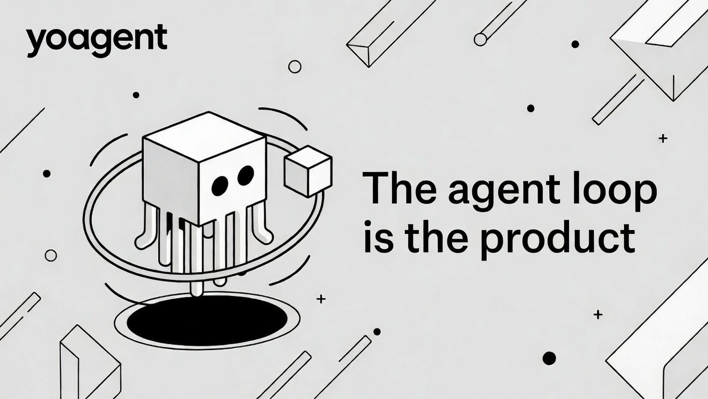

<div align="center">

<picture>
  
</picture>

<a href="https://crates.io/crates/yoagent">crates.io</a> · <a href="https://yologdev.github.io/yoagent/">Docs</a> · <a href="https://docs.rs/yoagent">API</a> · <a href="https://github.com/yologdev/yoagent">GitHub</a> · <a href="https://deepwiki.com/yologdev/yoagent">DeepWiki</a> · <a href="CHANGELOG.md">Changelog</a>

[![][crates-shield]][crates-link]
[![][docsrs-shield]][docsrs-link]
[![][ci-shield]][ci-link]
[![][msrv-shield]][msrv-link]
[![][license-shield]][license-link]

**The agent loop for Rust.** Stream from any of 7 LLM protocols, run tools, loop until done.

</div>

<picture>
  <source media="(prefers-color-scheme: dark)" srcset="docs/images/loop.svg">
  <source media="(prefers-color-scheme: light)" srcset="docs/images/loop-light.svg">
  
</picture>

---

## Try it in one command — no API key

```bash
git clone https://github.com/yologdev/yoagent && cd yoagent
ollama serve &                                    # any local model works
cargo run --example cli -- --provider ollama
```

That's a working coding agent in your terminal — file read/write/edit, shell, ripgrep search,
streaming output, skills. No signup, no key, nothing to configure.

```
  yoagent cli — mini coding agent
  Type /quit to exit, /clear to reset

  model: llama3.1:8b
  cwd:   /home/user/my-project

> find all TODO comments in src/

  ▶ search 'TODO' ✓

Found 3 TODOs:
  src/main.rs:42: // TODO: handle edge case
  src/lib.rs:15:  // TODO: add tests
  src/utils.rs:8: // TODO: optimize this

  tokens: 1250 in / 89 out
```

Point it at a hosted model instead by swapping the flag:

```bash
ANTHROPIC_API_KEY=sk-... cargo run --example cli
GROQ_API_KEY=...        cargo run --example cli -- --provider groq --model openai/gpt-oss-120b
cargo run --example cli -- --api-url http://localhost:1234/v1 --model my-model   # LM Studio, llama.cpp, vLLM
```

---

## Install

```toml
[dependencies]
yoagent = "0.15"
tokio = { version = "1", features = ["full"] }
```

## Quick start

An agent that actually uses a tool — the thing the crate exists for:

```rust
use yoagent::provider::ModelConfig;
use yoagent::{tools, Agent, AgentEvent, StreamDelta};

#[tokio::main]
async fn main() {
    // The provider is selected from the config's protocol and the key is read
    // from ANTHROPIC_API_KEY. Call `.with_api_key(k)` to pass one explicitly.
    let mut agent = Agent::from_config(ModelConfig::claude_sonnet_5())
        .with_system_prompt("You are a coding assistant.")
        .with_tools(tools::default_tools());

    let mut events = agent.prompt("Find every TODO in src/ and summarise them").await;

    while let Some(event) = events.recv().await {
        match event {
            AgentEvent::MessageUpdate { delta: StreamDelta::Text { delta }, .. } => print!("{delta}"),
            AgentEvent::ToolExecutionStart { tool_name, .. } => println!("\n▶ {tool_name}"),
            AgentEvent::AgentEnd { .. } => break,
            _ => {}
        }
    }
    agent.finish().await;
}
```

Swap the model by swapping the config — the provider follows, and the key is read from that
provider's conventional env var:

```rust
Agent::from_config(ModelConfig::groq("openai/gpt-oss-120b", "GPT-OSS 120B"));    // GROQ_API_KEY
Agent::from_config(ModelConfig::google("gemini-3.8-flash", "Gemini 3.8 Flash")); // GEMINI_API_KEY
Agent::from_config(ModelConfig::ollama("http://localhost:11434", "llama3.1:8b")); // no key
```

---

## How yoagent differs

yoagent is deliberately narrow. It is the loop, tool execution, and the machinery you need to
run that loop in production. It ships **no** vector stores, embedding pipelines, or task-graph
layer — if your problem is retrieval or orchestration, one of these is the better fit:

| If you need | Look at |
|---|---|
| RAG pipelines, vector stores, embeddings, transcription and image generation | [`rig`](https://github.com/0xPlaygrounds/rig) — *"Build modular and scalable LLM Applications in Rust"* |
| Typed task graphs and streaming RAG indexing alongside agents | [`swiftide`](https://github.com/bosun-ai/swiftide) — *"Composable LLM agents and harness, typed task graphs, and streaming RAG pipelines in Rust"* |
| A tool-calling loop you host, gate, steer, branch, and record | yoagent |

What that focus bought:

- **The loop is a free function.** [`agent_loop()`](src/agent_loop.rs) is stateless and takes
  everything it needs as arguments. `Agent` is an *optional* wrapper that adds history and queues.
  You can drive the loop yourself without adopting our state model.
- **7 native wire protocols**, not one OpenAI-compat shim with adapters bolted on. Anthropic
  Messages, OpenAI Completions, OpenAI Responses, Azure, Gemini, Vertex, and Bedrock each have a
  real implementation, so provider-specific features (thinking budgets, prompt-cache breakpoints,
  reasoning deltas) survive instead of being flattened away.
- **Every tool call passes one gate.** `ToolMiddleware` can allow, **modify**, or deny each call
  at a single choke point shared by all execution strategies — the mechanism behind approval
  prompts and policy engines.
- **Steer a run that's already going.** Inject guidance mid-flight; it's picked up between tool
  batches without restarting the turn.
- **History is a tree, not a list.** [`Session`](src/session.rs) forks, checkpoints, and seeks.
  Edit an earlier turn and re-run it without destroying the original branch.
- **Runs are recordable.** With `features = ["gasp"]`, a run becomes an append-only semantic
  event log in a git repo — restore is clone + replay. Conformance-checked in CI.
- **The whole loop is testable offline.** `MockProvider` scripts multi-turn tool-calling
  conversations and honours cancellation, so abort and steering paths are testable with no
  network. 456 of our 463 tests need no key.

---

## Built with yoagent

**[yoyo-evolve](https://github.com/yologdev/yoyo-evolve)** [![][yoyo-stars]][yoyo-link] — a coding
agent that evolves its own source in public. It began as 200 lines of Rust; every commit since has
been agent-written and gated on tests. It runs on this loop with the `openapi` feature enabled.

Also built on yoagent:

| Project | What it is |
|---|---|
| [`rab`](https://github.com/markokocic/rab) | A lightweight, extensible Rust coding agent |
| [`greatsage`](https://github.com/rick68/greatsage) | "Rimuru's Unique Skill, you know the one" |
| [`yoclaw`](https://github.com/yologdev/yoclaw) | OpenClaw reborn in Rust — a single-binary agent that remembers you |

Built something on yoagent? [Open a PR](CONTRIBUTING.md) and add it here — we'd like to see it.

---

## What's in the box

<details open>
<summary><b>The loop &amp; control</b></summary>

- Full event stream: `AgentStart` → `TurnStart` → `MessageUpdate` (deltas) → `ToolExecution*` → `TurnEnd` → `AgentEnd`
- Parallel tool execution by default; `Sequential` and `Batched { size }` strategies available
- **Steering** — interrupt mid-run; **follow-ups** — queue work after completion; both queues are inspectable and editable
- **`ToolMiddleware`** — async `Allow` / `Modify(args)` / `Deny(reason)` hooks gating every call. A denial becomes an error tool result the model sees, so the loop keeps going
- **`InputFilter`** — rewrite or reject user input before it reaches the model (PII redaction, prompt-injection guards)
- Execution limits (max turns, max tokens, wall-clock timeout), `abort()`, and lifecycle callbacks (`before_turn`, `after_turn`, `on_error`)
- Automatic retry with exponential backoff and ±20% jitter, for rate-limit and network errors only

</details>

<details>
<summary><b>Providers</b> — 7 protocols, 20+ providers</summary>

| Protocol | Providers |
|----------|-----------|
| Anthropic Messages | Anthropic (Claude) |
| OpenAI Completions | OpenAI, xAI, Groq, Cerebras, OpenRouter, Mistral, DeepSeek, MiniMax, Z.ai, Qwen, Meta (Muse Spark), Ollama, local servers, custom compatible APIs |
| OpenAI Responses | OpenAI (Responses API) |
| Azure OpenAI | Azure OpenAI |
| Google Generative AI | Google Gemini |
| Google Vertex | Google Vertex AI |
| Bedrock ConverseStream | Amazon Bedrock |

`ModelConfig` presets cover the common providers; `ModelConfig::openai_compat(..)` handles anything
else with a `base_url`. Per-provider quirks (auth style, reasoning format, `max_tokens` field name)
live in `OpenAiCompat` / `AnthropicCompat` flags — 12 compat profiles ship in the box.

The `opencode_zen(..)` / `opencode_go(..)` gateways pick the wire protocol from the model id
automatically, so one config reaches models across several vendors.

Thinking/reasoning controls are wired for all 7 protocols. Client-side cache hints are sent on two:
Anthropic gets `cache_control` breakpoints, native OpenAI gets a `prompt_cache_key`. Most others cache
server-side with nothing to configure; Bedrock does not cache automatically, and its explicit
`cachePoint` blocks are not yet wired. Context-overflow detection is centralised across 15+
provider-specific error strings.

</details>

<details>
<summary><b>Tools</b> — built-in, custom, MCP, OpenAPI</summary>

Built in: `bash` (timeout, deny patterns), `read_file` / `write_file` (line numbers, path
restrictions), `edit_file` (fuzzy-match hints on failure), `list_files`, `search` (ripgrep).
Tools return stdout *and* stderr even on failure, so the model can self-correct.

Custom tools implement one trait:

```rust
#[async_trait::async_trait]
impl AgentTool for GreetTool {
    fn name(&self) -> &str { "greet" }
    fn label(&self) -> &str { "Greet" }
    fn description(&self) -> &str { "Greets someone" }
    fn parameters_schema(&self) -> serde_json::Value {
        serde_json::json!({ "type": "object", "properties": { "name": { "type": "string" } } })
    }
    async fn execute(&self, params: serde_json::Value, _ctx: ToolContext)
        -> Result<ToolResult, ToolError>
    {
        let name = params["name"].as_str().unwrap_or("stranger");
        Ok(ToolResult {
            content: vec![Content::Text { text: format!("Hello, {name}!") }],
            details: serde_json::Value::Null,
        })
    }
}
```

**MCP** — `with_mcp_server_stdio()` / `with_mcp_server_http()` connect to Model Context Protocol
servers over stdio or Streamable HTTP (session ids, SSE framing, incremental parsing) and register
their tools transparently.

**OpenAPI** (`features = ["openapi"]`) — point `with_openapi_url()` at a spec and every operation
becomes a tool, filtered by `OperationFilter`.

</details>

<details>
<summary><b>Sub-agents &amp; shared state</b></summary>

<picture>
  <source media="(prefers-color-scheme: dark)" srcset="docs/images/subagents.svg">
  <source media="(prefers-color-scheme: light)" srcset="docs/images/subagents-light.svg">
  
</picture>

`SubAgentTool` delegates to a child loop with its own model, system prompt, tools, skills,
middleware, retry policy, and turn limits — a fully independent configuration, not a thin shim.
Run a cheap model for triage and an expensive one for the hard step in the same session.

`SharedState` is a pluggable key-value store (`MemoryBackend`, `FileBackend`, or your own via the
`SharedStateBackend` trait). A parent stores a large artifact once and sub-agents read it by key,
so it never gets re-pasted into every context window. Opt in with `.with_shared_state(state)` —
it injects the `shared_state` tool and a state summary into the sub-agent's system prompt.

</details>

<details>
<summary><b>Context, sessions &amp; skills</b></summary>

- **`ContextTracker`** — hybrid real-usage + estimation, calibrated against actual provider usage
- **Tiered compaction** — truncate tool outputs → summarise old turns → drop middle turns
- **`LlmCompaction`** — opt-in alternative that summarises the dropped span with a background LLM request instead of discarding it. The request runs off the hot path and is spliced in on a later turn, so the loop never stalls and can never wedge on it — an unfinished or failed summary falls back to the deterministic tiers. Buys retention quality; costs tokens the default never spends, and does *not* reduce prefix-cache breaks. Both paths report their own cost on `AgentEvent::ContextCompacted`

  ```rust,ignore
  let agent = Agent::from_config(ModelConfig::anthropic("claude-sonnet-5", "Sonnet 5"))
      .with_compaction_strategy(LlmCompaction::from_config(
          ModelConfig::anthropic("claude-haiku-4-5", "Haiku 4.5"),  // cheap model for summaries
      ));
  ```
- **`Session`** — history as an id/parent tree with `append`, `seek`, `checkpoint`, `branch_tips`, and JSONL persistence. Appending after a seek forks a branch; it never overwrites
- **Skills** — load [AgentSkills](https://agentskills.io)-standard `SKILL.md` directories. The agent sees a compact index and reads the full skill on demand, so skills stay cross-compatible with Claude Code, Codex CLI, Cursor, and others
- **Structured outputs** — `prompt_structured::<T>()` returns typed, schema-validated replies, enforced natively where supported (Anthropic `output_config.format` on the `claude_*` presets, tool-forcing otherwise; OpenAI Chat Completions `json_schema`; Gemini `responseSchema`)

</details>

<details>
<summary><b>Production concerns</b></summary>

- **Cost tracking** — `CostConfig` carries separate input/output/cache-read/cache-write rates plus optional context tiers; `session_cost_usd()` gives a running total, `AgentEvent::AgentEnd` carries a `SessionStats` rollup, and `ModelConfig::cost` is an `Option` — `None` means pricing unknown, never $0 (only the named presets carry verified rates)
- **Loop detection** — a model calling one tool with identical arguments forever trips none of the turn/token/duration limits until the whole budget is spent. On by default: steers on the third consecutive repeat, stops on the next, and emits `AgentEvent::LoopDetected` either way
- **Retrievable tool output** — head-tail truncation discards the middle irrecoverably. Attach a `SharedState` and the full text is stashed, with the marker naming a key the model can fetch
- **Telemetry** — `tracing` spans per loop / LLM stream / tool, recording tokens and cost. OpenTelemetry is bridged app-side via `tracing-opentelemetry`; the library carries no OTel dependency by design
- **GASP** (`features = ["gasp"]`) — record runs into a [GASP](https://github.com/yologdev/gasp) agent repo; yoagent is a tested-conformant runtime, with the 7-check suite running in CI
- **Serde throughout** — every core type is `Serialize` / `Deserialize` / `PartialEq`, so sessions persist and replay
- **`set_model()`** — hot-swap the model mid-session without rebuilding the agent

</details>

---

## Examples

Ten runnable examples in [`examples/`](examples/). Five need no API key at all.

| Example | What it shows | Key needed |
|---|---|---|
| [`cli`](examples/cli.rs) | A 370-line coding agent — all tools, skills, streaming, colored output. Like a baby Claude Code | optional¹ |
| [`rlm`](examples/rlm.rs) | An LLM that explores a codebase on its own by spawning sub-agents | yes |
| [`code_review`](examples/code_review.rs) | Three sub-agents reviewing a diff in parallel, results merged | yes |
| [`shared_state`](examples/shared_state.rs) | Passing a large artifact between sub-agents by reference | yes |
| [`sub_agent`](examples/sub_agent.rs) | Delegation basics with a per-sub-agent model | yes |
| [`basic`](examples/basic.rs) | The smallest possible agent | yes |
| [`callbacks`](examples/callbacks.rs) | Lifecycle hooks and a custom tool | **no** |
| [`persistence`](examples/persistence.rs) | Save and restore a session | **no** |
| [`telemetry`](examples/telemetry.rs) | `tracing` spans with token and cost fields | **no** |
| [`gasp_emit`](examples/gasp_emit.rs) | Recording a run into a GASP repo | **no** |

¹ `--provider ollama` or `--api-url` needs no key; hosted providers read their conventional env var.

---

## Testing & CI

`MockProvider` scripts a whole multi-turn tool-calling conversation with no network:

```rust
use yoagent::provider::mock::{MockProvider, MockResponse, MockToolCall};

let provider = MockProvider::new(vec![
    MockResponse::ToolCalls(vec![MockToolCall {
        name: "search".into(),
        arguments: serde_json::json!({ "pattern": "TODO" }),
        provider_metadata: None,
    }]),
    MockResponse::Text("Found 3 TODOs.".into()),
]);
let agent = Agent::from_provider(provider, ModelConfig::mock());
```

It emits real `StreamEvent`s and honours the `CancellationToken`, so abort and steering paths are
testable too.

- **463 tests**, of which **456 run with no network and no API keys** — `cargo test --all-features`
- Provider SSE streams tested at the HTTP level with `wiremock` across 8 suites
- `clippy --all-targets --all-features` with `-Dwarnings`, `cargo fmt --check`
- Linux + macOS test matrix, a Windows compile check, a pinned **MSRV 1.86** job, and a GASP conformance job

---

## Module map

| Module | What lives there |
|---|---|
| [`agent_loop`](src/agent_loop.rs) | The loop itself — `agent_loop`, `agent_loop_continue`, `AgentLoopConfig`, execution strategies |
| [`agent`](src/agent.rs) | Optional stateful wrapper — history, tool registry, steering/follow-up queues |
| [`types`](src/types.rs) | `Message`, `Content`, `AgentEvent`, `AgentTool`, `ToolMiddleware`, `InputFilter` |
| [`provider/`](src/provider/) | `StreamProvider` trait, `ModelConfig`, registry, and the 7 protocol implementations + `MockProvider` |
| [`tools/`](src/tools/) | `bash`, `file`, `edit`, `list`, `search`, `shared_state_tool` |
| [`sub_agent`](src/sub_agent.rs) | `SubAgentTool` — delegation to child loops |
| [`shared_state`](src/shared_state.rs) | `SharedState` + pluggable backends |
| [`session`](src/session.rs) | Branching conversation trees with JSONL persistence |
| [`context`](src/context.rs) | Token tracking, tiered compaction, execution limits |
| [`skills`](src/skills.rs) | AgentSkills `SKILL.md` loading |
| [`retry`](src/retry.rs) | Backoff with jitter |
| [`mcp/`](src/mcp/) | MCP client, stdio + HTTP transports, tool adapter |
| [`openapi/`](src/openapi/) | OpenAPI 3.0 → tools (feature `openapi`) |
| [`gasp`](src/gasp.rs) | Run recording into a GASP repo (feature `gasp`) |

---

## Documentation

- **[The book](https://yologdev.github.io/yoagent/)** — concepts, guides, and a page per provider ([source](docs/))
- **[API reference](https://docs.rs/yoagent)** — built with all features enabled
- **[CHANGELOG](CHANGELOG.md)** — every release
- **[CONTRIBUTING](CONTRIBUTING.md)** — how to build, test, and send a PR

MSRV is **1.86**, enforced in CI. Raising it is a minor-version change.

## License

MIT — see [LICENSE](LICENSE).

<!-- Badge link definitions -->
[crates-shield]: https://img.shields.io/crates/v/yoagent?labelColor=black&style=flat-square&logo=rust&color=orange
[crates-link]: https://crates.io/crates/yoagent
[docsrs-shield]: https://img.shields.io/docsrs/yoagent?labelColor=black&style=flat-square&logo=docsdotrs&label=docs.rs
[docsrs-link]: https://docs.rs/yoagent
[ci-shield]: https://img.shields.io/github/actions/workflow/status/yologdev/yoagent/ci.yml?labelColor=black&style=flat-square&logo=github&label=CI
[ci-link]: https://github.com/yologdev/yoagent/actions/workflows/ci.yml
[msrv-shield]: https://img.shields.io/badge/MSRV-1.86-blue?labelColor=black&style=flat-square&logo=rust
[msrv-link]: https://github.com/yologdev/yoagent/blob/main/Cargo.toml
[license-shield]: https://img.shields.io/badge/license-MIT-white?labelColor=black&style=flat-square
[license-link]: https://github.com/yologdev/yoagent/blob/main/LICENSE
[yoyo-stars]: https://img.shields.io/github/stars/yologdev/yoyo-evolve?labelColor=black&style=flat-square&color=c4f042
[yoyo-link]: https://github.com/yologdev/yoyo-evolve
