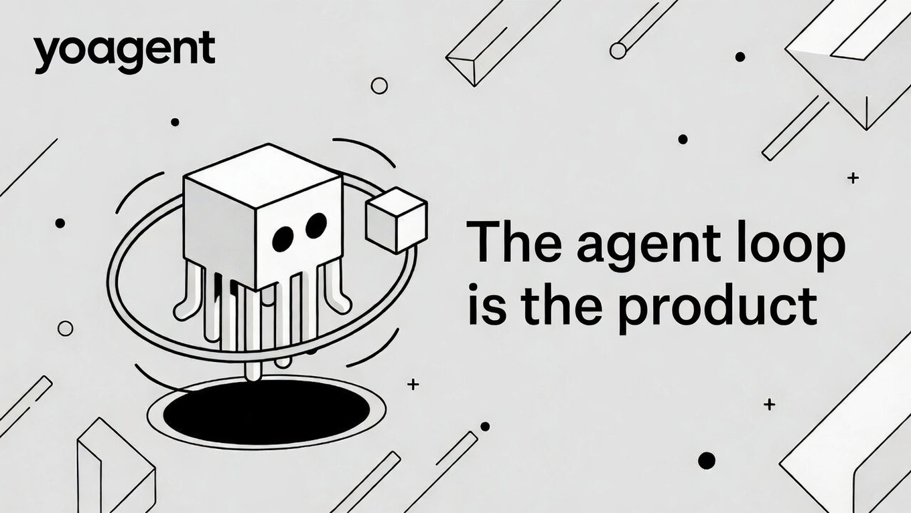
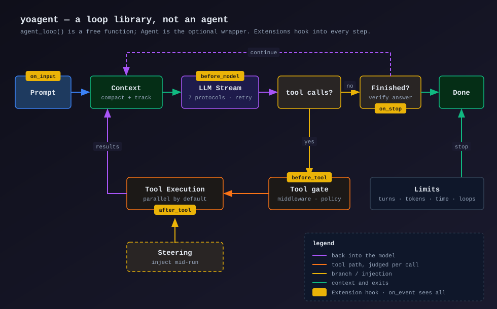

<div align="center">

<picture>
  
</picture>

<a href="https://crates.io/crates/yoagent">crates.io</a> · <a href="https://yologdev.github.io/yoagent/">Docs</a> · <a href="https://docs.rs/yoagent">API</a> · <a href="https://github.com/yologdev/yoagent">GitHub</a> · <a href="https://deepwiki.com/yologdev/yoagent">DeepWiki</a> · <a href="CHANGELOG.md">Changelog</a>

[![][crates-shield]][crates-link]
[![][docsrs-shield]][docsrs-link]
[![][ci-shield]][ci-link]
[![][msrv-shield]][msrv-link]
[![][license-shield]][license-link]

**The agent loop for Rust.** Stream from any of 7 LLM protocols, run tools, loop until done.

[A loop library, not an agent](https://yologdev.github.io/yoagent/design-philosophy.html): it powers [yoyo](https://github.com/yologdev/yoyo-evolve), a coding agent evolving its own source since March 2026, and runs from a laptop to a Cloudflare Worker.

</div>

<picture>
  <source media="(prefers-color-scheme: dark)" srcset="docs/images/loop.svg">
  <source media="(prefers-color-scheme: light)" srcset="docs/images/loop-light.svg">
  
</picture>

---

## Try it in one command — no API key

```bash
git clone https://github.com/yologdev/yoagent && cd yoagent
ollama serve &
ollama pull llama3.1:8b                           # or pass --model <any pulled model>
cargo run --example cli -- --provider ollama
```

That's a working coding agent in your terminal — file read/write/edit, shell, ripgrep search,
streaming output, skills. No signup, no key, nothing to configure.

```
  yoagent cli — mini coding agent
  Type /quit to exit, /clear to reset

  model: llama3.1:8b
  cwd:   /home/user/my-project

> find all TODO comments in src/

  ▶ search 'TODO' ✓

Found 3 TODOs:
  src/main.rs:42: // TODO: handle edge case
  src/lib.rs:15:  // TODO: add tests
  src/utils.rs:8: // TODO: optimize this

  tokens: 1250 in / 89 out
```

Point it at a hosted model instead by swapping the flag:

```bash
ANTHROPIC_API_KEY=sk-... cargo run --example cli
GROQ_API_KEY=...        cargo run --example cli -- --provider groq --model openai/gpt-oss-120b
cargo run --example cli -- --api-url http://localhost:1234/v1 --model my-model   # LM Studio, llama.cpp, vLLM
```

---

## Install

```toml
[dependencies]
yoagent = "0.25"
tokio = { version = "1", features = ["full"] }
```

Building for wasm32? Use `default-features = false` (see
[WebAssembly & Cloudflare Workers](https://yologdev.github.io/yoagent/guides/wasm-workers.html)).
On a native target keep the default `native` feature: without it reqwest has no TLS, and every
HTTPS provider call fails at runtime.

## Quick start

An agent that actually uses a tool — the thing the crate exists for:

```rust
use yoagent::provider::ModelConfig;
use yoagent::{tools, Agent, AgentEvent, StreamDelta};

#[tokio::main]
async fn main() {
    // The provider is selected from the config's protocol and the key is read
    // from ANTHROPIC_API_KEY. Call `.with_api_key(k)` to pass one explicitly.
    let mut agent = Agent::from_config(ModelConfig::claude_sonnet_5())
        .with_system_prompt("You are a coding assistant.")
        .with_tools(tools::default_tools());

    let mut events = agent.prompt("Find every TODO in src/ and summarise them").await;

    while let Some(event) = events.recv().await {
        match event {
            AgentEvent::MessageUpdate { delta: StreamDelta::Text { delta }, .. } => print!("{delta}"),
            AgentEvent::ToolExecutionStart { tool_name, .. } => println!("\n▶ {tool_name}"),
            AgentEvent::AgentEnd { .. } => break,
            _ => {}
        }
    }
    agent.finish().await;
}
```

Swap the model by swapping the config — the provider follows, and the key is read from that
provider's conventional env var:

```rust
Agent::from_config(ModelConfig::groq("openai/gpt-oss-120b", "GPT-OSS 120B"));    // GROQ_API_KEY
Agent::from_config(ModelConfig::google("gemini-3.8-flash", "Gemini 3.8 Flash")); // GEMINI_API_KEY
Agent::from_config(ModelConfig::ollama("http://localhost:11434/v1", "llama3.1:8b")); // no key
```

---

## Why yoagent

Every agent runs the same loop, and almost every hand-written one gets the same things wrong:
streams that end badly, tools that panic or hang, context that runs out, runs that never stop,
spend nobody can account for. yoagent writes that loop once, with each guarantee pinned by a
test, and keeps one rule for what goes in: **does every agent need it, the same way?** Anything
else is an extension, a feature or a companion crate
([design philosophy](https://yologdev.github.io/yoagent/design-philosophy.html)).

So it ships **no** vector stores, embedding pipelines, or task-graph layer — if your problem is
retrieval or orchestration, one of these is the better fit:

| If you need | Look at |
|---|---|
| RAG pipelines, vector stores, embeddings, transcription and image generation | [`rig`](https://github.com/0xPlaygrounds/rig) — *"Build modular and scalable LLM Applications in Rust"* |
| Typed task graphs and streaming RAG indexing alongside agents | [`swiftide`](https://github.com/bosun-ai/swiftide) — *"Composable LLM agents and harness, typed task graphs, and streaming RAG pipelines in Rust"* |
| A tool-calling loop you host, gate, steer, branch, and record | yoagent |

What that focus bought:

- **The loop is a free function.** [`agent_loop()`](src/agent_loop.rs) is stateless and takes
  everything it needs as arguments. `Agent` is an *optional* wrapper that adds history and queues.
  You can drive the loop yourself without adopting our state model.
- **7 native wire protocols**, not one OpenAI-compat shim with adapters bolted on. Anthropic
  Messages, OpenAI Completions, OpenAI Responses, Azure, Gemini, Vertex, and Bedrock each have a
  real implementation, so provider-specific features (thinking budgets, prompt-cache breakpoints,
  reasoning deltas) survive instead of being flattened away.
- **One plug-in contract for the whole run.** An `Extension` can add tools, check input, allow,
  **modify** or deny each tool call, redact results, and check the final answer, with state
  that starts fresh each run. Install it as host policy and it governs every sub-agent too.
  Hooks that guard a call fail closed: a policy that cannot run denies, an input check rejects,
  a redaction that fails withholds.
- **Steer a run that's already going.** Inject guidance mid-flight; it's picked up between tool
  batches without restarting the turn.
- **History is a tree, not a list.** [`Session`](src/session.rs) forks, checkpoints, and seeks.
  Edit an earlier turn and re-run it without destroying the original branch.
- **Runs are recordable.** With `features = ["gasp"]`, a run becomes an append-only semantic
  event log in a git repo — restore is clone + replay. Conformance-checked in CI.
- **The whole loop is testable offline.** `MockProvider` scripts multi-turn tool-calling
  conversations and honours cancellation, so abort and steering paths are testable with no
  network or key.

---

## Extend it

Everything that changes what the loop does goes through one contract, `Extension`: its run's
`RunHooks` see `on_input`, `before_model`, `before_tool`, `after_tool`, `on_stop`, every event,
and `finish`. A tool policy is a few lines:

```rust
use yoagent::extension::{ClonedHooks, RunHooks};
use yoagent::{ToolCallRequest, ToolDecision};

#[derive(Clone)]
struct NoForcePush;

#[async_trait::async_trait] // the `async-trait` crate
impl RunHooks for NoForcePush {
    async fn before_tool(&self, call: &ToolCallRequest<'_>) -> ToolDecision {
        let command = call.args["command"].as_str().unwrap_or_default();
        if command.contains("push --force") {
            ToolDecision::Deny("force-push is not allowed here".into())
        } else {
            ToolDecision::Allow
        }
    }
}

let agent = agent.with_extension(ClonedHooks::new("no-force-push", NoForcePush));
```

yoagent's own budget, tool gate and input guard are built the same way. Six runnable
`extension_*` examples cover policies, redaction, verifiers, budgets, sub-agent policy and
audit logs ([guide](https://yologdev.github.io/yoagent/concepts/extensions.html)).

**Plugins and other ecosystems.** [`yoagent-rutis`](integrations/yoagent-rutis/) turns
[rutis](https://github.com/arcships/rutis) plugins — Rust, TypeScript or Python, loaded,
reloaded and unloaded at runtime — into one `Extension`. Through small adapters it also runs many
[pi](https://github.com/earendil-works/pi) extensions and DSH tool plugins unchanged, with no
change to yoagent's core: tools, tool policies, input checks, prompt additions and images cross
over; commands and UI don't. An extension that hooks something the adapter can't enforce is
refused, not half-run.

## Runs where agents run

The same loop builds natively and for `wasm32-unknown-unknown`. In yoyo's Cloudflare Worker we
measured about **4 ms** to start and a median of **~45 ms of CPU per agent run** — an agent
spends most of a run waiting on the model, which Workers do not bill as CPU. A minimal Worker
(one provider via `Agent::from_provider`, one tool, no decision model) is about 330 KiB gzipped. HTTP MCP works over the host's `fetch`;
[`yoagent-workers`](integrations/yoagent-workers/) turns the Workers AI binding into a decision
model. See [WebAssembly & Cloudflare Workers](https://yologdev.github.io/yoagent/guides/wasm-workers.html).

---

## Built with yoagent

**[yoyo-evolve](https://github.com/yologdev/yoyo-evolve)** [![][yoyo-stars]][yoyo-link] — a coding
agent that evolves its own source in public. It began as 200 lines of Rust; every commit since has
been agent-written and gated on tests. It runs on this loop with the `openapi` feature enabled.

Also built on yoagent:

| Project | What it is |
|---|---|
| [`rab`](https://github.com/markokocic/rab) | A lightweight, extensible Rust coding agent |
| [`greatsage`](https://github.com/rick68/greatsage) | "Rimuru's Unique Skill, you know the one" |
| [`yoclaw`](https://github.com/yologdev/yoclaw) | OpenClaw reborn in Rust — a single-binary agent that remembers you |

Built something on yoagent? [Open a PR](CONTRIBUTING.md) and add it here — we'd like to see it.

---

## What's in the box

| | | |
|---|---|---|
| **The loop** | Full event stream; parallel, sequential or batched tools; steering and follow-ups; execution limits; retry with backoff and jitter | [Agent loop](https://yologdev.github.io/yoagent/concepts/agent-loop.html) · [Events](https://yologdev.github.io/yoagent/concepts/messages-events.html) · [Retry](https://yologdev.github.io/yoagent/concepts/retry.html) |
| **Extensions** | One plug-in contract for the run; `Budget`; the older hooks (`ToolMiddleware`, input filters, `TurnHook`, callbacks) still work | [Extensions](https://yologdev.github.io/yoagent/concepts/extensions.html) · [Callbacks](https://yologdev.github.io/yoagent/concepts/callbacks.html) |
| **Providers** | 7 native protocols reaching 20+ providers; thinking controls; prompt-cache hints; one context-overflow classifier | [Providers](https://yologdev.github.io/yoagent/providers/overview.html) · [Prompt caching](https://yologdev.github.io/yoagent/concepts/prompt-caching.html) |
| **Tools** | `bash`, file read/write/edit, `list_files`, `search`; custom tools via one trait; MCP over stdio or HTTP; OpenAPI specs; per-run `ToolSource`s | [Tools](https://yologdev.github.io/yoagent/concepts/tools.html) · [MCP](https://yologdev.github.io/yoagent/guides/mcp.html) · [OpenAPI](https://yologdev.github.io/yoagent/guides/openapi.html) |
| **Sub-agents** | Child loops with their own model and tools; large artifacts passed by reference; spend rolled up | [Sub-agents](https://yologdev.github.io/yoagent/concepts/sub-agents.html) |
| **Context** | Usage-calibrated tracking, tiered compaction, optional `LlmCompaction`, loop detection | [Context management](https://yologdev.github.io/yoagent/concepts/context-management.html) |
| **Sessions, skills, structured output** | Branching session trees with JSONL; AgentSkills `SKILL.md`; typed `prompt_structured::<T>()` | [Sessions](https://yologdev.github.io/yoagent/concepts/session-trees.html) · [Skills](https://yologdev.github.io/yoagent/concepts/skills.html) · [Structured outputs](https://yologdev.github.io/yoagent/concepts/structured-outputs.html) |
| **Decision models** (`decision`) | Typed yes/no, one-of-N and score judgments in a few hundred ms (Jev, Clef, OpenAI Decisions, any logprobs server); a tool gate and an input guard | [Decision models](https://yologdev.github.io/yoagent/concepts/decision-models.html) |
| **Cost and telemetry** | Opt-in pricing (nothing priced by default); `SessionStats` per run incl. sub-agents; `tracing` spans with tokens and cost | [Pricing](https://yologdev.github.io/yoagent/concepts/pricing.html) · [Telemetry](https://yologdev.github.io/yoagent/concepts/telemetry.html) |
| **Recording** (`gasp`) | serde on every core type; runs recorded into a [GASP](https://github.com/yologdev/gasp) repo, plugin logs too (opt-in) | [Persistence](https://yologdev.github.io/yoagent/concepts/persistence.html) · [GASP](https://yologdev.github.io/yoagent/concepts/gasp.html) |
| **WebAssembly** | `--no-default-features` for `wasm32-unknown-unknown`, e.g. Cloudflare Workers | [WebAssembly & Workers](https://yologdev.github.io/yoagent/guides/wasm-workers.html) |

---

## Examples

Seventeen of the 22 runnable examples in [`examples/`](examples/) are below; ten need no API key at all (eleven counting `cli` with a local model). The rest are live-provider harnesses and offline evaluation sweeps.

| Example | What it shows | Key needed |
|---|---|---|
| [`cli`](examples/cli.rs) | A ~400-line coding agent — all tools, skills, streaming, colored output. Like a baby Claude Code | optional¹ |
| [`rlm`](examples/rlm.rs) | An LLM that explores a codebase on its own by spawning sub-agents | yes |
| [`code_review`](examples/code_review.rs) | Three sub-agents reviewing a diff in parallel, results merged | yes |
| [`shared_state`](examples/shared_state.rs) | Passing a large artifact between sub-agents by reference | yes |
| [`sub_agent`](examples/sub_agent.rs) | Delegation basics with a per-sub-agent model | yes |
| [`basic`](examples/basic.rs) | The smallest possible agent | yes |
| [`callbacks`](examples/callbacks.rs) | Lifecycle hooks and a custom tool | **no** |
| [`persistence`](examples/persistence.rs) | Save and restore a session | **no** |
| [`telemetry`](examples/telemetry.rs) | `tracing` spans with token and cost fields | **no** |
| [`gasp_emit`](examples/gasp_emit.rs) | Recording a run into a GASP repo | **no** |
| [`decision`](examples/decision.rs) | Decision-model questions in one line, and attaching a model to an agent (feature `decision`) | yes |
| [`extension_policy`](examples/extension_policy.rs), [`_redact`](examples/extension_redact.rs), [`_verifier`](examples/extension_verifier.rs), [`_budget`](examples/extension_budget.rs), [`_tree`](examples/extension_tree.rs), [`_audit`](examples/extension_audit.rs) | Extensions: a tool policy, redaction, a verifier, budgets, policy over sub-agents, an audit log ([guide](https://yologdev.github.io/yoagent/concepts/extensions.html)) | **no**² |

¹ `--provider ollama` or `--api-url` needs no key; hosted providers read their conventional env var.

² Scripted offline by default; `-- --live` uses `DEEPSEEK_API_KEY` or `ANTHROPIC_API_KEY`.

The companion crates have their own: [`language_plugins`, `pi_extensions` and `dsh_tools`](integrations/yoagent-rutis/README.md)
(TypeScript, Python, pi and DSH plugins) and a [Clef tool-gate Worker](integrations/yoagent-workers/examples/clef-worker/).

---

## Testing

`MockProvider` scripts a whole multi-turn tool-calling conversation with no network, and honours
cancellation, so abort and steering paths are testable too. See
[Testing Your Agent](https://yologdev.github.io/yoagent/guides/testing.html); how the crate itself is tested and what CI runs is
in [CONTRIBUTING](CONTRIBUTING.md).

---

## Documentation

- **[The book](https://yologdev.github.io/yoagent/)** — concepts, guides, a page per provider, and the [architecture and module map](https://yologdev.github.io/yoagent/architecture/overview.html) ([source](docs/))
- **[Design philosophy](https://yologdev.github.io/yoagent/design-philosophy.html)** — why yoagent is a loop library, the one extension contract, and what that costs
- **[API reference](https://docs.rs/yoagent)** — built with all features enabled
- **[CHANGELOG](CHANGELOG.md)** — every release
- **[CONTRIBUTING](CONTRIBUTING.md)** — how to build, test, and send a PR

MSRV is **1.86**, enforced in CI. Raising it is a minor-version change.

## Contributing

Bug reports, ideas and PRs are welcome — [open an issue](https://github.com/yologdev/yoagent/issues/new/choose)
or pick one labelled [help wanted](https://github.com/yologdev/yoagent/labels/help%20wanted).
[CONTRIBUTING](CONTRIBUTING.md) covers building, the checks CI runs, and the PR checklist.
Report security issues privately as described in [SECURITY](SECURITY.md).

## Acknowledgements

[rutis](https://github.com/arcships/rutis), the plugin runtime behind `yoagent-rutis`, and the
contributors who send fixes and ideas — including the ones who suggest them on X.

## License

MIT — see [LICENSE](LICENSE).

<!-- Badge link definitions -->
[crates-shield]: https://img.shields.io/crates/v/yoagent?labelColor=black&style=flat-square&logo=rust&color=orange
[crates-link]: https://crates.io/crates/yoagent
[docsrs-shield]: https://img.shields.io/docsrs/yoagent?labelColor=black&style=flat-square&logo=docsdotrs&label=docs.rs
[docsrs-link]: https://docs.rs/yoagent
[ci-shield]: https://img.shields.io/github/actions/workflow/status/yologdev/yoagent/ci.yml?labelColor=black&style=flat-square&logo=github&label=CI
[ci-link]: https://github.com/yologdev/yoagent/actions/workflows/ci.yml
[msrv-shield]: https://img.shields.io/badge/MSRV-1.86-blue?labelColor=black&style=flat-square&logo=rust
[msrv-link]: https://github.com/yologdev/yoagent/blob/main/Cargo.toml
[license-shield]: https://img.shields.io/badge/license-MIT-white?labelColor=black&style=flat-square
[license-link]: https://github.com/yologdev/yoagent/blob/main/LICENSE
[yoyo-stars]: https://img.shields.io/github/stars/yologdev/yoyo-evolve?labelColor=black&style=flat-square&color=c4f042
[yoyo-link]: https://github.com/yologdev/yoyo-evolve
